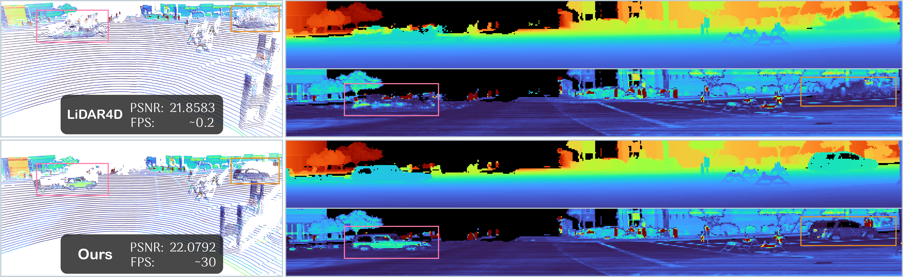

<div align="center">

<a href=https://zju3dv.github.io/lidar-rt/>
    
</a>

---

# LiDAR-RT: Gaussian-based Ray Tracing for Dynamic LiDAR Re-simulation

[**Chenxu Zhou***](https://zicx.top) · [**Lvchang Fu***](https://github.com/lllcccfff) · [**Sida Peng**<sup>&dagger;</sup>](https://pengsida.net/) · [**Yunzhi Yan**](https://yunzhiy.github.io/) · [**Zhanhua Zhang**](https://zju3dv.github.io/lidar-rt)
<br>
[**Yong Chen**](https://zju3dv.github.io/lidar-rt) · [**Jiazhi Xia**](https://www.xiajiazhi.com/) · [**Xiaowei Zhou**](https://xzhou.me)
<br>
CVPR 2025

[](https://arxiv.org/abs/2412.15199)
[](https://zju3dv.github.io/lidar-rt)
[](https://drive.google.com/file/d/1Y3gfleG9Mo9ZP7WPE65-P8NnvCRUYwVl/view)
[](https://github.com/zju3dv/lidar-rt)
</div>



## 📜 News

- [2025.4.17] The training and evaluation code has been released.
- [2025.2.27] 🎉 Our paper is accepted by CVPR 2025.

## ⚒️ Method


## 📦 Installation

Please refer to [INSTALL.md](./docs/INSTALL.md) for detailed installation instructions.

1. [Environment Setup](./docs/INSTALL.md#environment-setup)
2. [Data Preparation](./docs/INSTALL.md#data-preperation)

## 🚀 Training

Please refer to [TRAIN.md](./docs/TRAIN.md) for quick start of training.

### PandaSet

We also support PandaSet. The raw sequence directory is expected under `data/pandaset/<seq>/` and should contain the PandaSet sequence folders such as `lidar/` and `meta/` (camera/annotations are optional for LiDAR-only training).

Examples:

```bash
# vanilla origin
python train.py -dc configs/pandaset/static/1.yaml -ec configs/exp.yaml

# timestamp-based column origin
python train.py -dc configs/pandaset/static/1_timestamp.yaml -ec configs/exp.yaml

# per-point timestamp origin tracing
python train.py -dc configs/pandaset/static/1_timestamp_point.yaml -ec configs/exp.yaml
```

## 🔭 Evaluation

Please refer to [EVAL.md](./docs/EVAL.md) for evaluation and visualization.

## ❤️ Acknowledgments

This work is built upon the following codes, we would like to acknowledge these great works.

- [EnvGS: Modeling View-Dependent Appearance with Environment Gaussian](https://github.com/zju3dv/EnvGS)
- [Street Gaussians: Modeling Dynamic Urban Scenes with Gaussian Splatting](https://github.com/zju3dv/street_gaussians)
- [3D Gaussian Ray Tracing: Fast Tracing of Particle Scenes](https://gaussiantracer.github.io/)
- [3D Gaussian Splatting for Real-Time Radiance Field Rendering](https://github.com/graphdeco-inria/gaussian-splatting)

## 📝 Citation

If you find this code useful for your research, please use the following BibTeX entry.

```
@inproceedings{zhou2024lidarrt,
    title={{LiDAR-RT}: Gaussian-based Ray Tracing for Dynamic LiDAR Re-simulation},
    author={Zhou, Chenxu and Fu, Lvchang and Peng, Sida and Yan, Yunzhi and Zhang, Zhanhua and Chen, Yong and Xia, Jiazhi and Zhou, Xiaowei},
    booktitle={Proceedings of the IEEE/CVF Conference on Computer Vision and Pattern Recognition},
    year={2025}
}
```

## 💌 Contact

If you have any question, please feel free to contact [Chenxu Zhou](mailto:cxzhou35@zju.edu.cn) or Github issues.

## ⭐ Star History
[](https://starchart.cc/zju3dv/LiDAR-RT)
